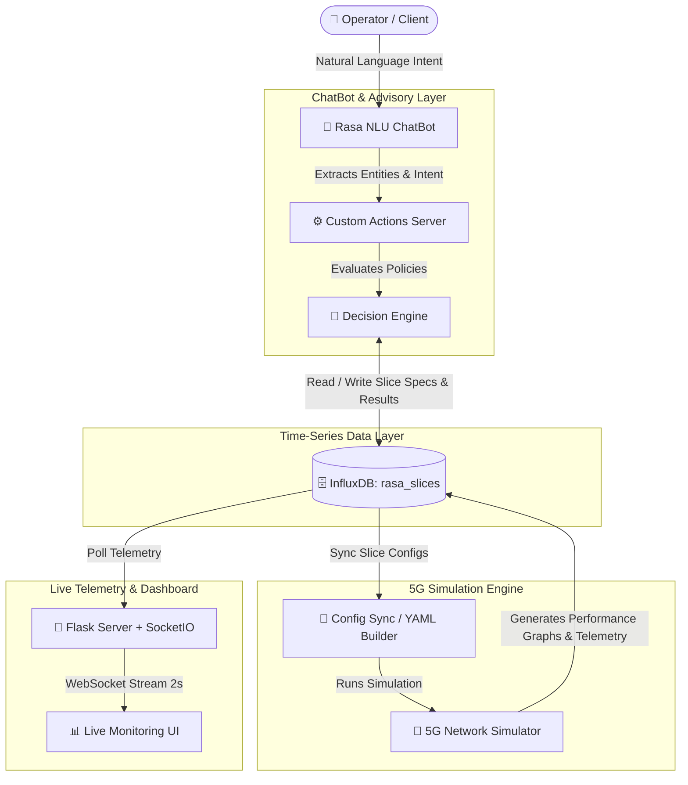
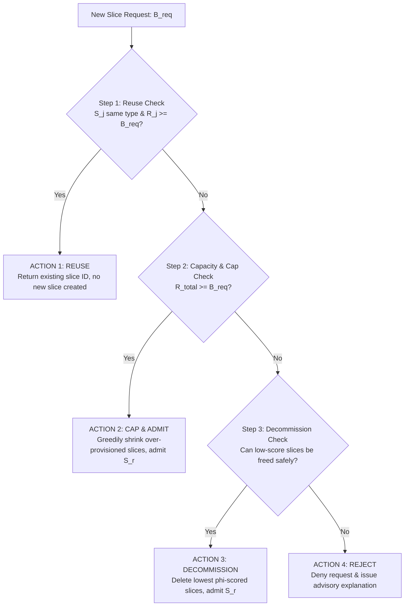

# 🌐 Intent-Based 5G Network Slicing & Resource Optimization Platform

[](https://www.python.org/)
[](https://rasa.com/)
[](https://www.influxdata.com/)
[](https://flask.palletsprojects.com/)
[](#)

An end-to-end **Intent-Based Networking (IBN)** framework for dynamic **5G Network Slicing, Resource Optimization, and Telemetry Visualization**.

This project bridges natural language user requests with a 5G discrete-event network simulator, backed by an intelligent **Optimization & Decision Engine**, time-series data storage in **InfluxDB**, and a live WebSocket-powered **Monitoring Dashboard**.

---

## 📌 Table of Contents

- [Overview](#-overview)
- [System Architecture](#-system-architecture)
- [Key Components](#-key-components)
  - [1. Intent-Based Conversational AI (`ChatBot_ibn`)](#1-intent-based-conversational-ai-chatbot_ibn)
  - [2. Slice Resource Optimization Engine](#2-slice-resource-optimization-engine)
  - [3. 5G Network Simulator (`5G-Network-Slicing`)](#3-5g-network-simulator-5g-network-slicing)
  - [4. Real-Time Telemetry Dashboard (`dashboard`)](#4-real-time-telemetry-dashboard-dashboard)
  - [5. Time-Series Data Store (InfluxDB)](#5-time-series-data-store-influxdb)
- [Mathematical Framework & Decision Cascade](#-mathematical-framework--decision-cascade)
  - [Slice Formal Representation](#slice-formal-representation)
  - [Key Quantities & Safety Headroom](#key-quantities--safety-headroom)
  - [Priority Decision Logic (Reuse → Cap → Decommission → Reject)](#priority-decision-logic-reuse--cap--decommission--reject)
- [Project Directory Structure](#-project-directory-structure)
- [Prerequisites & Environment Setup](#-prerequisites--environment-setup)
- [Step-by-Step Execution Guide](#-step-by-step-execution-guide)
- [NLP Interaction & Intent Examples](#-nlp-interaction--intent-examples)
- [Analytics & Visual Outputs](#-analytics--visual-outputs)
- [License & Acknowledgments](#-license--acknowledgments)

---

## 📚 Overview

Modern 5G networks rely on **Network Slicing** to partition physical infrastructure into multiple logical networks tailored to specific service requirements:
- **eMBB (Enhanced Mobile Broadband)**: High throughput for video streaming, AR/VR.
- **URLLC (Ultra-Reliable Low-Latency Communications)**: Low latency for autonomous driving, remote surgery, and interactive gaming.
- **mMTC (Massive Machine-Type Communications)**: High device density and low power consumption for IoT.

Managing these slices manually is complex and error-prone. This platform introduces **Intent-Based Networking (IBN)**:
1. **Translates High-Level Intent**: Network operators or clients state requirements in natural language (e.g., *"I need a video slice with 100 Mbps bandwidth and under 5 ms latency"*).
2. **Evaluates Optimization Rules**: Checks network capacity, historical slice load ratios, and SLA guarantees before taking action.
3. **Simulates Infrastructure Impact**: Executes dynamic simulation across base stations, clients, and traffic distributions.
4. **Monitors Real-Time Metrics**: Visualizes load ratios, throughput, and success rates on a streaming Web Dashboard.

---

## 🏗️ System Architecture



---

## 🧩 Key Components

### 1. Intent-Based Conversational AI (`ChatBot_ibn`)
- **Built with**: Rasa NLU & Rasa SDK
- **Functionality**:
  - Parses intent and extracts key slice entities: `service_type` (video, gaming, iot), `bandwidth`, `latency`, `reliability`, `duration`, `slice_id`, and modification parameters.
  - Implements two-phase confirmation workflows (proposing decisions with risk levels and asking user confirmation before committing changes).
  - Handles key intents:
    - `request_slice`: Requesting creation of a new slice.
    - `modify_slice`: Altering bandwidth, latency, or duration of an existing slice.
    - `delete_slice`: Removing a slice from active allocation.
    - `confirm_yes` / `confirm_no`: Approving or rejecting advisory recommendations.

### 2. Slice Resource Optimization Engine
- **Location**: `ChatBot_ibn/actions/decision_engine.py`
- **Functionality**:
  - Queries historical simulation telemetry (`slice_sim_result`) in InfluxDB to analyze slice health, load ratios, and success rates.
  - Formulates predictive advisories (`low`, `medium`, or `high` risk) prior to execution.
  - Prevents network degradation by blocking unsafe modifications/deletions when slices are heavily loaded (`load_ratio > 0.8`).

### 3. 5G Network Simulator (`5G-Network-Slicing`)
- **Built with**: Python, SimPy, Scikit-learn, Matplotlib
- **Location**: `5G-Network-Slicing/`
- **Modules**:
  - `BaseStation.py`: Models 5G cellular base stations, coverage radii, and connection limits.
  - `Client.py`: Simulates mobile devices/clients generating dynamic service traffic.
  - `Slice.py`: Manages network slice lifecycle and parameter allocation.
  - `Coverage.py`: Handles spatial signal propagation and mobility.
  - `Distributor.py`: Allocates clients across base stations and slice resources.
  - `Stats.py` & `Graph.py`: Computes network metrics and outputs visualization plots (`output.png`).

### 4. Real-Time Telemetry Dashboard (`dashboard`)
- **Built with**: Flask, Flask-SocketIO, Chart.js, HTML5/CSS3 (IBM Plex Typography & Dark Glassmorphism)
- **Location**: `dashboard/`
- **Features**:
  - Live WebSocket stream updating network metrics every 2 seconds.
  - Summary KPI cards: Total Active Slices, Overall Success Rate, Average Load Ratio, Total Bandwidth (Mbps/Gbps).
  - Live slice record table with load bar indicators, health status chips (`SUCCESS`, `PARTIAL`, `FAILED`), and search/column filtering.

### 5. Time-Series Data Store (InfluxDB)
- **Database**: `rasa_slices`
- **Measurements**:
  - `network_slice`: Stores target slice specifications (`slice_id`, `service_type`, `bandwidth`, `latency`, `reliability`, `duration`).
  - `slice_sim_result`: Stores telemetry output (`slice_name`, `load_ratio`, `success`, `used_bandwidth`, `connected_ratio`).

---

## 📐 Mathematical Framework & Decision Cascade

The system uses a mathematical slice optimization model to evaluate allocation requests and prevent resource drift.

### Slice Formal Representation
Each slice $S_i$ is represented as a tuple:
$$S_i = (t_i, B_{i,\text{alloc}}, B_{i,\text{used}}, U_i)$$

Where:
- $t_i$: Slice service type (e.g., `video`, `gaming`, `iot`)
- $B_{i,\text{alloc}}$: Allocated bandwidth (Mbps)
- $B_{i,\text{used}}$: Currently utilized bandwidth (Mbps)
- $U_i$: Active connected user count

### Key Quantities & Safety Headroom

| Metric | Formula | Description |
| :--- | :--- | :--- |
| **Safe Allocation Floor** | $B_{i,\text{safe}} = 0.9 \times B_{i,\text{alloc}}$ | Preserves a 10% safety buffer for SLA compliance and burst headroom. |
| **Utilization Ratio** | $\rho_i = \frac{B_{i,\text{used}}}{B_{i,\text{alloc}}}$ | Fraction of slice bandwidth currently in active use. |
| **Reclaimable Bandwidth** | $R_i = \max(0, B_{i,\text{safe}} - B_{i,\text{used}})$ | Headroom that can be safely reclaimed without impacting current load. |

### Priority Decision Logic (Reuse → Cap → Decommission → Reject)

When a new slice request $S_r$ with requested bandwidth $B_{\text{req}}$ arrives, the system evaluates actions in priority order:



#### Decommission Scoring Function
When capping alone is insufficient ($R_{\text{total}} < B_{\text{req}}$), active slices are scored to identify safe candidates for removal:
$$\phi_i = \alpha \cdot U_i + \beta \cdot \rho_i - \gamma \cdot \mathbb{I}[t_i = t_r]$$

Where:
- $\alpha = 0.5$: Weight for connected user count (higher active users $\rightarrow$ retain slice).
- $\beta = 0.3$: Weight for utilization ratio (higher utilization $\rightarrow$ retain slice).
- $\gamma = 0.2$: Penalty indicator if slice matches the requested service type.
- **Safety Guard**: Slices with $U_i > \theta$ (safety threshold) are protected from automated decommissioning.

---

## 📁 Project Directory Structure

```directory
/home/mohan/Desktop/IBN/
├── ChatBot_ibn/               # Rasa Chatbot & Advisory Component
│   ├── actions/               # Custom Rasa Actions & Optimization Logic
│   │   ├── actions.py         # Intent handlers for Create, Modify, Delete & Confirmation
│   │   └── decision_engine.py # Decision Engine, InfluxDB queries, & table formatters
│   └── data/                  # NLU intents, stories, and rules
│       ├── nlu.yml            # Intent training data
│       ├── rules.yml          # Conversation flow rules
│       └── stories.yml        # Multi-turn interaction stories
│
├── 5G-Network-Slicing/        # 5G Discrete-Event Network Simulator
│   ├── slicesim/              # Core simulation engine (BaseStation, Client, Slice, etc.)
│   ├── output.png             # Output simulation plots and charts
│   ├── stats.json             # Execution metrics output
│   ├── __main__.py            # Main simulation runner
│   └── requirements.txt       # Simulator dependencies
│
├── dashboard/                 # Real-Time Live Monitoring Dashboard
│   ├── server.py              # Flask + SocketIO backend streaming InfluxDB data
│   ├── requirements.txt       # Web server dependencies
│   └── templates/             # Dashboard UI templates
│       └── dashboard.html     # Live dark-themed Web Interface
│
├── dummy.py                   # Data seeding script for InfluxDB (`rasa_slices`)
├── requirements2.txt          # Python dependencies for simulation & analytics
├── ibn_slice_optimization.pdf # Mathematical optimization specification
└── ibn final ppt.pdf          # Presentation architecture overview
```

---

## 🛠️ Prerequisites & Environment Setup

### Environment Requirements
- **Linux OS** (Ubuntu 20.04 / 22.04 recommended)
- **Python**: 3.8 or higher
- **InfluxDB**: 1.8+ (running on `localhost:8086`)

### Installation Steps

1. **Clone & Navigate to Project Directory**:
   ```bash
   cd /home/mohan/Desktop/IBN
   ```

2. **Create and Activate a Virtual Environment**:
   ```bash
   python3 -m venv ibn
   source ibn/bin/activate
   ```

3. **Install Dependencies**:
   ```bash
   # Install simulator and analytics dependencies
   pip install -r requirements2.txt

   # Install dashboard dependencies
   pip install -r dashboard/requirements.txt

   # Install Rasa (if not already installed)
   pip install rasa rasa-sdk influxdb
   ```

---

## 🚀 Step-by-Step Execution Guide

### Step 1: Start InfluxDB & Seed Initial Data
Ensure InfluxDB is running locally on port `8086`:
```bash
# Start InfluxDB service (if using systemd)
sudo systemctl start influxdb

# Seed test slice configurations and initial telemetry
python3 dummy.py
```

### Step 2: Start Rasa Action Server
In a terminal window (with virtual environment activated):
```bash
cd /home/mohan/Desktop/IBN/ChatBot_ibn
rasa run actions --port 5055
```

### Step 3: Launch Rasa Chatbot NLU Shell
In a second terminal window:
```bash
cd /home/mohan/Desktop/IBN/ChatBot_ibn
rasa shell
```

### Step 4: Run the 5G Network Simulator
In a third terminal window:
```bash
cd /home/mohan/Desktop/IBN/5G-Network-Slicing
python3 __main__.py
```

### Step 5: Launch the Live Dashboard
In a fourth terminal window:
```bash
cd /home/mohan/Desktop/IBN/dashboard
python3 server.py
```
Open your browser and navigate to: **`http://localhost:5000`** to view the live dashboard.

---

## 💬 NLP Interaction & Intent Examples

### 1. Requesting a New Slice
> **User**: *"I want to create a video slice with 100 Mbps bandwidth, 5 ms latency, 99.99 reliability for 3 hours."*  
> **Bot**: 
> ```text
> Advisory (low risk):
> Found candidate slice 'slice_reuse1' (used: 40.0 Mbps, load: 0.30, free: 93.3 Mbps).
> An existing slice matches your requirements. Do you want to reuse it? (yes / no)
> ```  
> **User**: *"yes"*  
> **Bot**: *"You can now re-use this slice. Slice ID: slice_reuse1"*

### 2. Modifying an Existing Slice
> **User**: *"Modify bandwidth of slice_mod_high to 200 Mbps"*  
> **Bot**:  
> ```text
> Advisory (medium risk):
> Target slice is under high load (load ratio: 0.90). Increasing bandwidth will relieve congestion.
> Do you want to proceed with this modification? (yes / no)
> ```  
> **User**: *"yes"*  
> **Bot**: *"Slice slice_mod_high updated: bandwidth set to 200."*

### 3. Deleting a High-Risk Slice
> **User**: *"Delete slice slice_delete_busy"*  
> **Bot**:  
> ```text
> Advisory (high risk):
> Slice 'video_slice_slice_delete_busy' has active traffic (connected ratio: 0.90, load: 0.85). Deleting will disrupt connected users!
> Deletion blocked due to high risk. No changes were made.
> ```

---

## 📊 Analytics & Visual Outputs

The simulator produces graphical reports evaluating key network indicators across base stations and slice allocations:

| Metric | Target / Description |
| :--- | :--- |
| **Connected Clients Ratio** | Ratio of connected mobile clients vs. total requested clients |
| **Bandwidth Utilization** | Allocated bandwidth vs. consumed bandwidth per slice |
| **Load Ratio ($\rho$)** | Active load demand on base stations |
| **SLA Compliance Rate** | Percentage of operational requests meeting latency & reliability constraints |

*Simulation visualization outputs are automatically generated and saved to `5G-Network-Slicing/output.png`.*

---

## 📄 License & Acknowledgments

- **Open-Source Base**: Built upon the open-source 5G Network Slicing Simulation framework.
- **Rasa Framework**: Conversational NLU powered by Rasa Open Source.
- **InfluxData**: Time-series telemetry storage by InfluxDB.

---
*Developed for Intent-Based 5G Network Slice Orchestration & Optimization.*
